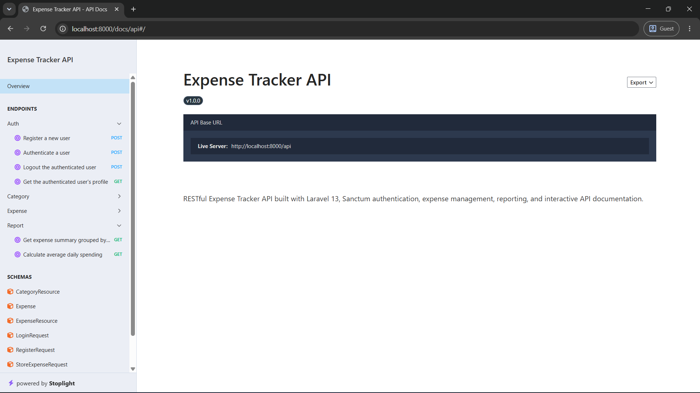
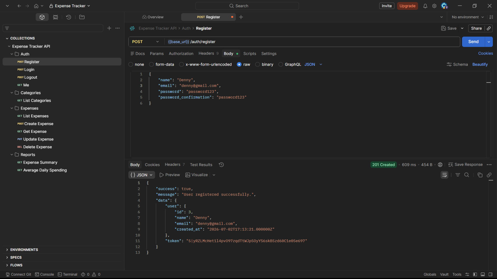

# Expense Tracker API

A RESTful Expense Tracker API built with Laravel 13 that enables users to securely manage expenses, organize them into predefined categories, and generate filtered expense reports. The project was developed as part of a backend hiring challenge with a focus on clean architecture, authentication, authorization, validation, and RESTful API design.

---

## Features

### Authentication

- User Registration
- User Login
- User Logout
- Retrieve Authenticated User Profile
- Laravel Sanctum Token Authentication

### Expense Management

- Create Expense
- View Expenses
- Update Expense
- Delete Expense
- Pagination Support
- Category Association

### Categories

- Predefined Categories
- Database Seeding
- Read-only Category API

### Reports

- Expense Summary grouped by Category
- Average Daily Spending
- Flexible Filtering
    - Date Range
    - Category

### API

- RESTful Design
- JSON Responses
- Proper HTTP Status Codes
- Consistent Error Handling
- Interactive API Documentation using Scramble

---

## Tech Stack

- PHP 8.3
- Laravel 13
- Laravel Sanctum
- MySQL
- Scramble API Documentation

---

## Architecture

The project follows a RESTful API-only architecture.

The API is organized into:

- Controllers
- Form Requests
- API Resources
- Policies
- Eloquent Models
- Database Seeders

The application follows Laravel conventions by using Form Requests for validation, Policies for authorization, API Resources for response transformation, and Route Model Binding for clean controller logic.

---

## Project Structure

```
app
├── Http
│   ├── Controllers
│   ├── Requests
│   └── Resources
├── Models
├── Policies
database
├── migrations
├── seeders
routes
└── api.php
```

---

## Database Design

```
Users
   │
   │ 1
   │
   ├───────────────∞ Expenses
                    │
                    │
                    │ ∞
                    │
                    1
                Categories
```

### Tables

#### Users

Stores authenticated users.

#### Categories

Stores predefined expense categories.

#### Expenses

Stores expense records belonging to users.

---

## Design Decisions

### Why is `amount` stored as DECIMAL instead of FLOAT?

Although the challenge specifies a float value for the expense amount, the database uses `DECIMAL(10,2)`.

This avoids floating-point precision issues when storing monetary values and is the recommended approach for financial data.

### Why are `categories` stored in a separate table?

The challenge mentions predefined categories.

Instead of hardcoding category names inside the application, categories are stored in a dedicated table and seeded during database setup.

Benefits:

- Maintains referential integrity
- Avoids duplicated category names
- Makes future category management easier
- Allows reports to efficiently group expenses by category

---

## API Endpoints

| Module         | Endpoints                               |
| -------------- | --------------------------------------- |
| Authentication | Register, Login, Logout, Profile        |
| Categories     | List Categories                         |
| Expenses       | CRUD Operations                         |
| Reports        | Expense Summary, Average Daily Spending |

Detailed API documentation is available via Scramble.

---

## Authentication

Authentication is implemented using Laravel Sanctum.

Protected endpoints require the following header:

```text
Authorization: Bearer <access_token>
```

---

## Installation

Clone the repository

```bash
git clone https://github.com/dennyneelamkavil/expense-tracker-api.git

cd expense-tracker-api
```

Install dependencies

```bash
composer install
```

Copy environment

```bash
cp .env.example .env
```

Generate application key

```bash
php artisan key:generate
```

Configure database credentials inside `.env`.

Run migrations and seeders

```bash
php artisan migrate --seed
```

Start the server

```bash
php artisan serve
```

---

## API Documentation



Interactive API documentation is generated using Scramble.

After running the project, open:

```text
http://localhost:8000/docs/api
```

---

## Postman Collection



A Postman collection is included under the `postman/` directory for testing all API endpoints.

### Import the collection

Import the following collection:

```text
postman/Expense Tracker API.postman_collection.json
```

### Configure the collection

Set the collection variable:

```text
base_url=http://localhost:8000/api
```

### Authenticate

1. Run the **Register** request to create a new user, or use the **Login** request if you already have an account.
2. Copy the `access_token` from the response.
3. Save the token as a Postman Vault secret named `token` (used as `{{vault:token}}` by the collection).

Once the `base_url` variable and `token` Vault secret are configured, all authenticated requests in the collection can be executed without additional changes.

---

## Testing

The API was tested using:

- Postman
- Scramble Interactive Documentation

Validation, authentication, authorization, pagination, and reporting endpoints were verified manually.

---

## Future Improvements

- Category Management (Create, Update, Delete)
- Admin Reporting Dashboard
- Export Reports (CSV / PDF)
- Budget Tracking
- Recurring Expenses
- Charts & Analytics
